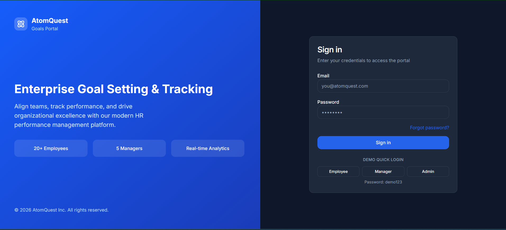
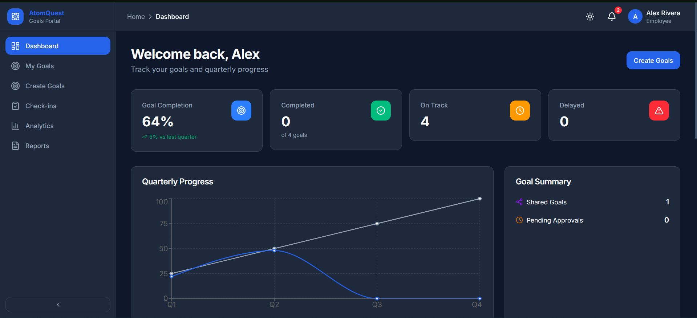
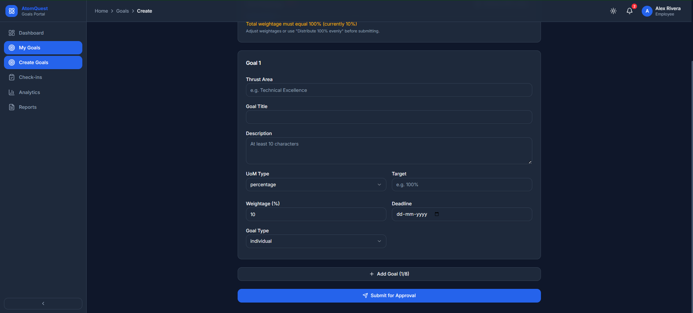
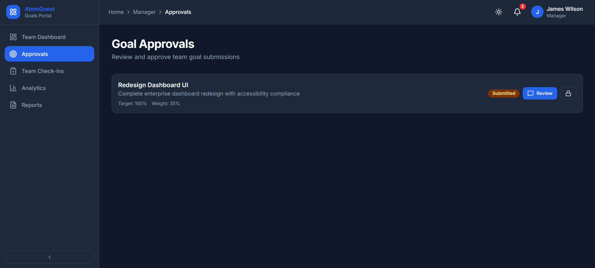
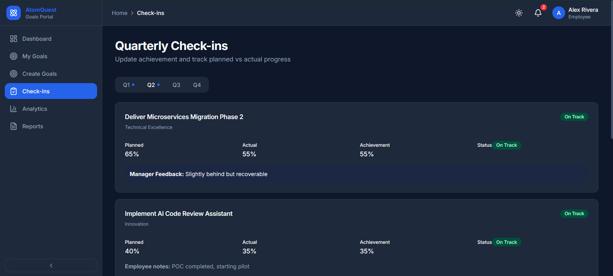
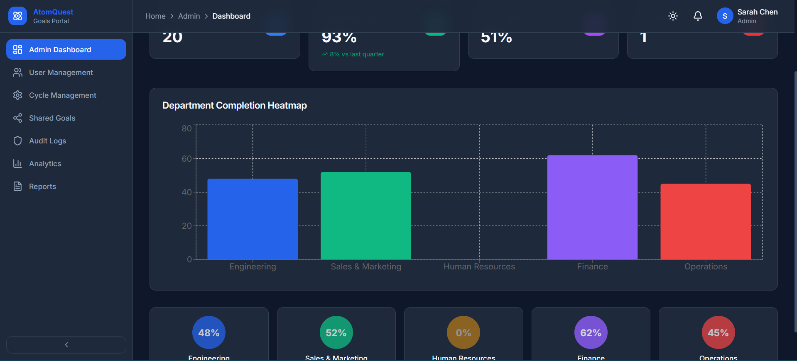
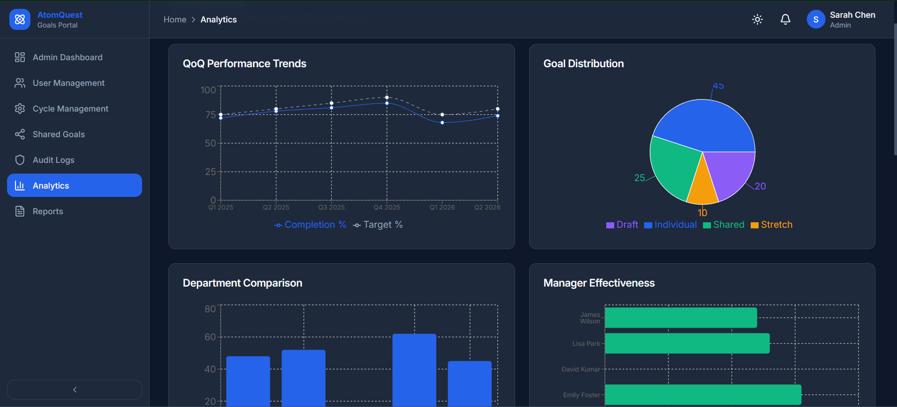
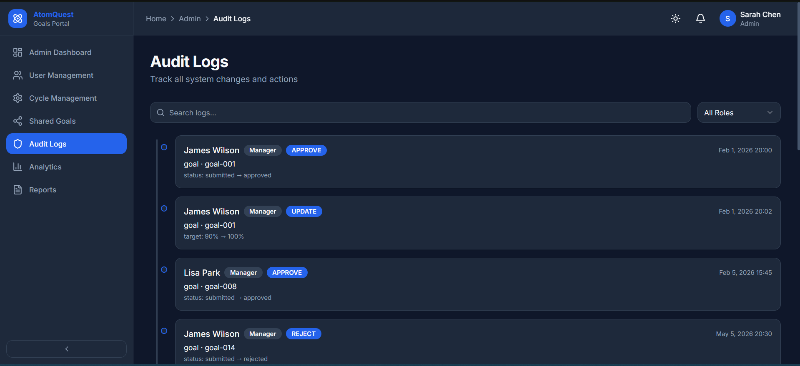
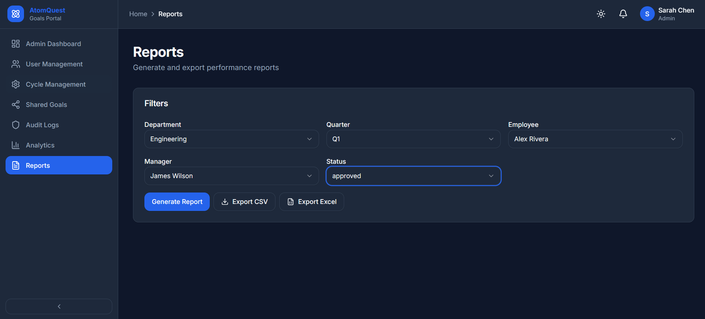

# AtomQuest Goals Portal

Enterprise Goal Setting & Tracking Portal — a production-style React frontend for HR performance management.

    

## Quick Start

```bash
npm install
npm run dev
```

## Live Demo

[AtomQuest Goals Portal](https://atom-quest-goals-portal.vercel.app)

## Demo Accounts

| Role     | Email                   | Password |
|----------|-------------------------|----------|
| Employee | employee@atomquest.com  | demo123  |
| Manager  | manager@atomquest.com   | demo123  |
| Admin    | admin@atomquest.com     | demo123  |

Use the **Demo Quick Login** buttons on the sign-in page for one-click access.

## Tech Stack

- **React 19** + **TypeScript** + **Vite 8**
- **Tailwind CSS v4** + shadcn/ui-style components
- **React Router v7** — role-based routing
- **React Hook Form** + **Zod** — form validation
- **Framer Motion** — animations
- **Recharts** — analytics charts
- **Sonner** — toast notifications

## Features

### Authentication
- Login, forgot password, role-based redirect
- Demo quick-login for Employee / Manager / Admin

### Employee
- KPI dashboard with quarterly progress chart
- Goal creation (max 8 goals, 100% weightage validation)
- Draft save & submit workflow
- Quarterly check-ins (Q1–Q4)
- Goals list with search & filters

### Manager
- Team dashboard with analytics
- Inline goal approval (approve / reject / edit target / lock)
- Team check-in reviews

### Admin
- Organization completion metrics & heatmap
- User management (27 users: 20 employees, 5 managers, 2 admins)
- Cycle management & goal sheet unlock
- Shared departmental KPIs
- Audit log timeline with search & filters

### Shared Modules
- Analytics (QoQ trends, pie/bar charts, leaderboard, heatmap)
- Reports (CSV/Excel export with filters)
- Dark/light mode toggle
- Notifications, breadcrumbs, loading skeletons

## Project Structure

```
src/
├── components/
│   ├── ui/           # shadcn-style primitives
│   ├── layout/       # Sidebar, Navbar
│   └── shared/       # KPICard, StatusBadge, EmptyState
├── pages/
│   ├── auth/         # Login, Forgot Password
│   ├── employee/     # Employee Dashboard
│   ├── manager/      # Manager Dashboard, Approvals
│   ├── admin/        # Admin modules
│   ├── goals/        # Goals list & creation
│   ├── checkins/     # Quarterly check-ins
│   ├── analytics/    # Charts & insights
│   └── reports/      # Export & filters
├── layouts/          # AppLayout, AuthLayout
├── services/         # Mock API layer
├── data/             # Static JSON mock database
├── context/          # Auth, Theme providers
├── hooks/            # Custom hooks
├── routes/           # Route definitions
├── types/            # TypeScript interfaces
└── utils/            # Helpers, validation
```

## Mock Database

| File               | Contents                          |
|--------------------|-----------------------------------|
| users.json         | 27 users across 3 roles           |
| goals.json         | Sample goals with statuses        |
| checkins.json      | Quarterly check-in records        |
| auditLogs.json     | System audit trail                |
| departments.json   | 5 departments                     |
| notifications.json | User notifications                |
| sharedGoals.json   | Departmental shared KPIs          |
| cycles.json        | Performance cycles                |

## Application Screenshots

### Login Page


### Employee Dashboard


### Goal Creation


### Manager Approvals


### Quarterly Check-ins


### Admin Dashboard


### Analytics Module


### Audit Logs


### Reports & Export


## Scripts

```bash
npm run dev      # Start dev server
npm run build    # Production build
npm run preview  # Preview production build
npm run lint     # ESLint
```

## License

Built for AtomQuest Hackathon 2026.
